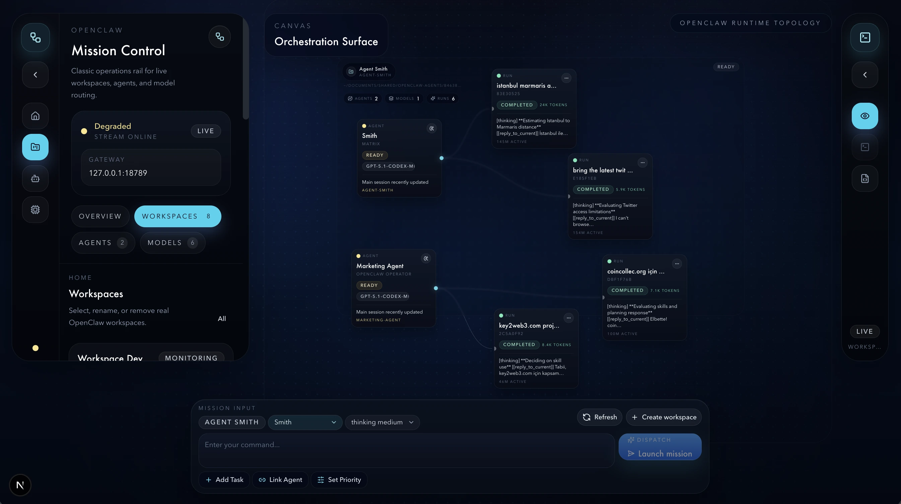
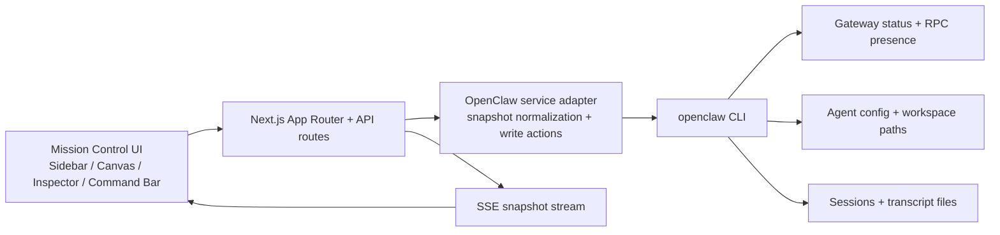

<div align="center">
  
</div>

<div align="center">

# OpenClaw Mission Control

**A production-grade control surface for live OpenClaw workspaces, agents, models, and runtimes.**

Mission Control turns OpenClaw's real operational surface into a single UI for observation and action. It reads live gateway state, workspaces, agents, models, sessions, and transcript-backed runtime output, then lets operators dispatch missions and manage workspace state without leaving the console.

<p>
  
  
  
  
  
  
</p>

<p>
  <a href="#why-this-is-different"><strong>Why this is different</strong></a>
  |
  <a href="#core-capabilities"><strong>Core capabilities</strong></a>
  |
  <a href="#ui-tour"><strong>UI tour</strong></a>
  |
  <a href="#system-architecture"><strong>System architecture</strong></a>
  |
  <a href="#quick-start"><strong>Quick start</strong></a>
  |
  <a href="#live-data-sources"><strong>Live data sources</strong></a>
  |
  <a href="#api-surface"><strong>API surface</strong></a>
</p>

</div>

## Why This Is Different

Most orchestration dashboards stop at observation. Mission Control is built to close the loop between **live state**, **runtime topology**, and **real OpenClaw actions**.

| See | Act |
| --- | --- |
| Gateway health, presence, version, and warnings | Dispatch missions through real `openclaw agent` runs |
| Workspace -> agent -> runtime relationships | Create, rename, move, and delete workspaces |
| Session-derived runtime cards | Create and update agents from the UI |
| Transcript-backed runtime output | Reply to or copy prompts from live runtimes |
| Real model inventory and usage | Refresh and inspect current operational state without reloading |

## Core Capabilities

<table>
  <tr>
    <td width="50%" valign="top">
      <h3>Live topology canvas</h3>
      <p>React Flow renders real workspace, agent, and runtime relationships with fit-to-view behavior, node selection, and runtime emphasis for the active workspace.</p>
    </td>
    <td width="50%" valign="top">
      <h3>Command-first mission dispatch</h3>
      <p>The mission bar submits directly to <code>openclaw agent</code>, supports thinking levels, and shows optimistic runtime creation while the run is being synchronized.</p>
    </td>
  </tr>
  <tr>
    <td width="50%" valign="top">
      <h3>Operator-grade inspection</h3>
      <p>The inspector exposes entity overviews, raw JSON payloads, and transcript-derived runtime output so active runs can be debugged without leaving the shell.</p>
    </td>
    <td width="50%" valign="top">
      <h3>Real workspace lifecycle</h3>
      <p>Workspace creation, rename, move, and deletion are backed by filesystem operations plus OpenClaw agent/config updates rather than front-end-only mocks.</p>
    </td>
  </tr>
  <tr>
    <td width="50%" valign="top">
      <h3>Agent management</h3>
      <p>Create and update agents, change models, and attach identity metadata from the sidebar while staying grounded in the active workspace.</p>
    </td>
    <td width="50%" valign="top">
      <h3>Streaming updates with fallback</h3>
      <p>State refreshes over Server-Sent Events. If OpenClaw is unavailable, the UI falls back to a clearly marked demo snapshot instead of pretending live state exists.</p>
    </td>
  </tr>
</table>

## UI Tour

| Surface | Purpose |
| --- | --- |
| `MissionSidebar` | Gateway diagnostics, workspace navigation, agents, models, and CRUD flows for workspaces and agents |
| `MissionCanvas` | Workspace -> agent -> runtime topology with selection, pending mission feedback, and runtime-level actions |
| `InspectorPanel` | Selected entity overview, runtime output, and raw payload inspection |
| `CommandBar` | Mission composition, target agent selection, thinking level selection, refresh, and workspace creation |

## System Architecture



### Repository Map

```text
app/
  api/
    agents/route.ts
    diagnostics/route.ts
    mission/route.ts
    runtimes/[runtimeId]/route.ts
    snapshot/route.ts
    stream/route.ts
    workspaces/route.ts
  layout.tsx
  page.tsx

components/mission-control/
  command-bar.tsx
  canvas.tsx
  inspector-panel.tsx
  mission-control-shell.tsx
  sidebar.tsx
  nodes/

hooks/
  use-mission-control-data.ts

lib/openclaw/
  cli.ts
  fallback.ts
  presenters.ts
  service.ts
  types.ts
```

## Quick Start

### Prerequisites

- A recent Node.js runtime
- `pnpm`
- OpenClaw installed locally and reachable on `PATH`

If OpenClaw is installed in a non-standard location, point the app at it:

```bash
export OPENCLAW_BIN=/absolute/path/to/openclaw
```

### Install and run

```bash
pnpm install
openclaw --version
openclaw gateway status --json
pnpm dev
```

If the gateway is missing or not loaded:

```bash
openclaw gateway install --force --json
openclaw gateway status --json
```

Open the local URL printed by Next.js. In a typical setup that will be:

```text
http://localhost:3000
```

### Quality checks

```bash
pnpm typecheck
pnpm lint
pnpm build
```

## Live Data Sources

Mission Control derives its live snapshot from real OpenClaw surfaces instead of hard-coded dashboard fixtures.

| Source | Used for |
| --- | --- |
| `openclaw gateway status --json` | Gateway bind mode, port, service load state, RPC health, probe URL |
| `openclaw status --json` | Version, update channel, security findings, recent sessions, heartbeat metadata |
| `openclaw agents list --json` | Agent identity, workspace mapping, bindings, defaults |
| `openclaw config get agents.list --json` | Agent skills, configured tools, identity metadata, workspace config |
| `openclaw models list --json` | Available models, provider metadata, context windows, tags |
| `openclaw sessions --all-agents --json` | Runtime/session cards, token usage, model/provider linkage, timestamps |
| `openclaw gateway call system-presence --json` | Presence diagnostics and host visibility |
| Local transcript files | Turn-level runtime output, final text, stop reason, and message history |

## API Surface

| Route | Method | Purpose |
| --- | --- | --- |
| `/api/snapshot` | `GET` | Returns the normalized mission control snapshot |
| `/api/stream` | `GET` | Streams snapshot updates over SSE |
| `/api/diagnostics` | `GET` | Returns gateway diagnostics and presence |
| `/api/mission` | `POST` | Dispatches a mission to a real OpenClaw agent |
| `/api/agents` | `GET`, `POST`, `PATCH` | Reads, creates, and updates agents |
| `/api/workspaces` | `GET`, `POST`, `PATCH`, `DELETE` | Reads and mutates workspace projects |
| `/api/runtimes/:runtimeId` | `GET` | Resolves transcript-backed runtime output for the selected run |

## Fallback Behavior

When OpenClaw cannot be reached, the app returns a structured fallback snapshot with demo workspaces, agents, models, and runtimes. The goal is to keep the interface explorable while making the offline state explicit. No fallback surface is presented as live control.

## Operational Notes

- Initial state is loaded server-side in [`app/page.tsx`](./app/page.tsx) for a fast first render.
- Client refresh uses `EventSource` in [`hooks/use-mission-control-data.ts`](./hooks/use-mission-control-data.ts).
- JSON parsing in [`lib/openclaw/cli.ts`](./lib/openclaw/cli.ts) is defensive against noisy CLI output.
- Runtime detail inspection is transcript-backed through [`lib/openclaw/service.ts`](./lib/openclaw/service.ts).
- Mission dispatch, workspace mutation, and agent mutation all invalidate the snapshot cache and rehydrate live state.

## Tech Stack

- Next.js App Router
- TypeScript
- Tailwind CSS
- shadcn/ui-style primitives
- React Flow
- Motion for React
- Zod

## License

This repository does not currently include a license file.
